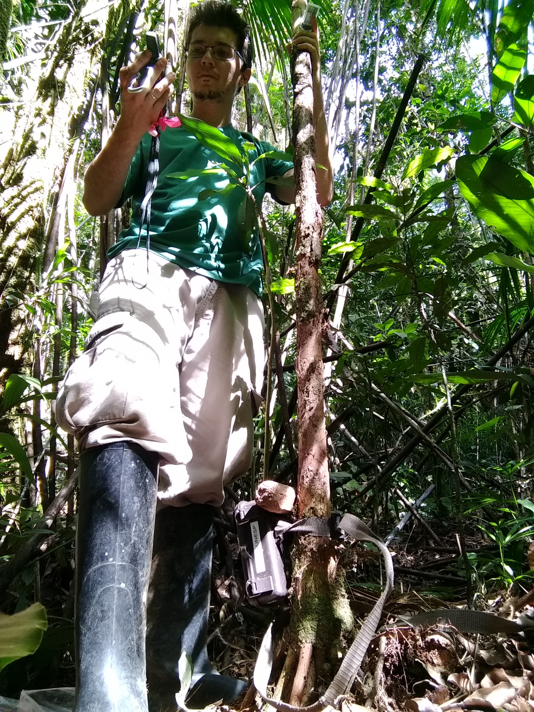

```{r setup, include=FALSE}
knitr::opts_chunk$set(echo = FALSE)
```





### What I do

From t-tests to deep learning, I've covered a lot of ground in modeling, visualizing, and understanding data.  I can provide inference for models on millions of observations, classify biomedical images to determine pathology, and scrape the web to explore political sentiment. What's more, I can help others understand the results and take appropriate action regarding them. 

Analytically speaking, I have a fairly wide exposure to modeling techniques, from traditional models to their extensions in clustered, temporal, spatial and nonlinear contexts. I have employed latent variable models, machine learning techniques, Bayesian approaches, dealt with unstructured data (e.g. text analysis), and more.  Moreover, I have taught, written about, or conducted workshops on these topics, helping others gain expertise to become self-sufficient in their own efforts.

I spend most of my programming time in the <span itemscope itemtype ="https://schema.org/ComputerLanguage">R</span> world, with which I have many years of experience using it as my primary programming tool. I have written countless lines of code to extract information, examine complex relationships, and visualize everything from the mundane to the abstract. 


I spend the bulk of my other efforts in coding with <span itemscope itemtype ="https://schema.org/ComputerLanguage">Python</span>, where I've used it for general machine learning models, natural language processing, and other endeavors. I also have to consistently dive into other programming as necessary, such as for web development and report generation. I like programming in general and solving problems with it, and I'm lucky enough to spend regular time simply learning new modeling and programming tricks.


### Personal

Displaced Texan... one-time psychologist/philosopher... aesthetically leans toward De Stijl, Barthelme, Ashbery, and synthwave... has been known to grow things like dahlias, okra, and exquisitely hot peppers... enjoys walking, running, biking... sometimes knows what he's talking about...


### Academic Background

<span itemprop="description">
While my interest is in data science generally, I started off majoring in [psychology](http://www.psy.tcu.edu/) and [philosophy](http://www.phil.tcu.edu/) as an undergraduate, and eventually obtained a Ph.D. in [Experimental Psychology](http://psychology.unt.edu/). During graduate school, I became interested in statistics for practical reasons, eventually choosing it as a concentration, and I also started consulting at that time. That turned out to be a good fit for me, and I've been exploring and analyzing data ever since.
</span>


### Present

<span itemprop="description">
Currently I am a <span itemprop="jobTitle">Senior Machine Learning Scientist</span> for [<span itemprop="worksFor memberOf">Strong Analytics</span>](https://www.strong.io/), where I provide analytical insights and programming expertise to enable clients from a variety of industries meet their goals.
</span>

<span itemprop="description">
Previously, I was a lead statistician for [CSCAR](https://cscar.research.umich.edu/) at the University of Michigan, and before that, I was a statistical consultant with the <span itemprop="affiliation alumniOf">[Center for Social Science Research](http://cssr.nd.edu/) at the University of Notre Dame.  In both settings I provided analytical, visualization, programming, conceptual, and other support to the larger research community. 
</span>

<br>

I am passionate about doing quality work that answers the questions at hand. What drew me to the world of data science and keeps my interest is that it frees me to engage in whatever science I like, and provides a great many tools with which to discover more about the things we humans are most interested in. CV can be found [here](../cv.html).

<br>

