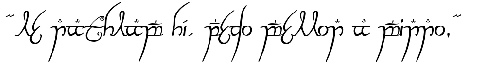

I am an Ecologist fascinated by how the environment and its organisms relate to each other to keep the world as we know moving. Besides Ecology, I also spend a lot of time reading and searching about technology, computing, and Data Science. This last one was something that grew on me in the past years, so I am trying to connect its techniques and tools with Ecology studies. During my free time, I like hanging out with people to have beers and talk about books, tv series, games, and sci-fi. Fun (nerd) fact about me: I love the Middle Earth histories and the MTG card game.

"*Le nathlam hí, pedo mellon a minno*"